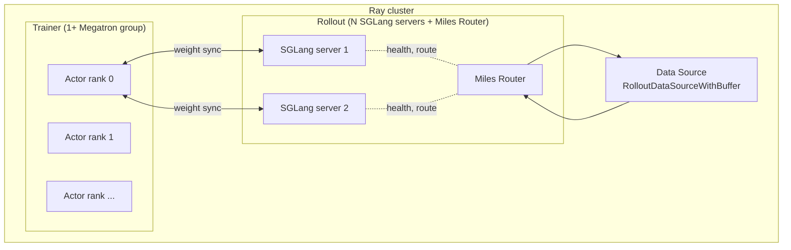
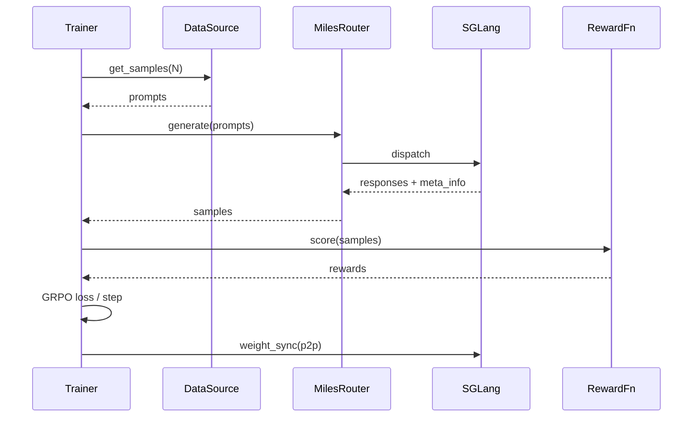

A reading guide before you start patching.

## The processes

A Miles run is three kinds of processes wrapped in a Ray cluster:



* **Trainer ranks** — Megatron processes that load `torch_dist` checkpoints and run the
  RL loop.
* **SGLang servers** — independent HTTP services that produce rollouts.
* **Miles Router** — FastAPI proxy that distributes rollout requests, preserves
  metadata (R3), and enforces health checks.
* **Data Source** — Python object owned by the trainer; reads prompt JSONL and acts as
  a buffer between rollout and training.

## The package layout

```text
miles/
├── backends/             # one directory per backend, plus what they share
│   ├── megatron_utils/   # Megatron actor, update_weight/, checkpointing, fp32 markers
│   ├── fsdp_utils/       # FSDP2 actor, adaptations/ per architecture, MoE kernels
│   ├── sglang_utils/     # SGLang engine wrapper + argument glue
│   └── training_utils/   # loss.py / loss_hub/, ParallelState, log + CI checkers
├── ray/                  # Ray actors, placement groups, train/ and rollout/ groups
├── rollout/
│   ├── sglang_rollout.py # legacy v1 rollout function
│   ├── data_source.py    # buffer + JSONL loader
│   ├── filter_hub/       # built-in filters
│   ├── rm_hub/           # built-in reward types (`--rm-type` dispatch)
│   ├── fully_async_*.py  # queue-backed producer for train_async.py
│   └── inference_rollout/# default class-based rollout
├── router/               # FastAPI proxy + worker load-balancer (router.py)
├── dashboard/            # run dashboard: collector, backend, dump reader
├── true_on_policy/       # true-on-policy contracts and per-model profiles
└── utils/                # arguments.py, async / IO / distributed helpers, audit_utils/
```

The `miles_plugins/` tree sits beside it. Nothing in `miles/` imports it directly: a plugin
is loaded only when a run names its import path in a flag (`--spec`, or one of the
`--custom-*-path` flags). `models/` holds Megatron specs and HF module wrappers, `mbridge/`
per-architecture weight bridges, `megatron_bridge/` the `megatron.bridge` shims, and
`optimizers/` optimizer plugins.

`train.py` and `train_async.py` are the entry points. They are
thin; most logic lives in the modules above.

## A request's life

For a single GRPO iteration:



This is the sync path. Fully async (`train_async.py --fully-async`) breaks the request
from the trainer loop and uses a continuously-running worker.

## Where common changes go

| You want to … | Edit |
|---|---|
| Add a new RL algorithm | `miles/backends/training_utils/loss.py` and `loss_hub/`, plus the enum in `miles/utils/arguments.py` |
| Add a new built-in reward type | `miles/rollout/rm_hub/` (the `rm_type` dispatch lives in its `__init__.py`) |
| Add a new built-in filter | `miles/rollout/filter_hub/` |
| Support a new architecture on Megatron | `miles_plugins/models/<model>.py` + a bridge in `miles_plugins/mbridge/` |
| Support a new architecture on FSDP | `miles/backends/fsdp_utils/adaptations/specs/<arch>.py` |
| Add a new flag | `miles/utils/arguments.py` |
| Change weight sync | `miles/backends/megatron_utils/update_weight/` (Megatron) or `miles/backends/fsdp_utils/update_weight_utils.py` (FSDP) |
| Change rollout buffer | `miles/rollout/data_source.py` |

## Extension points (the right way)

The trainer is plug-in-friendly. Most extensions don't need a code change inside Miles —
just pass a `--something-path my_pkg.thing`. See [Customization](/user-guide/customization)
for the full list.

If you find yourself patching the trainer to make something work, that's a sign we're
missing a hook. Open an issue.

## Tests

```text
tests/
├── fast/             # CPU CI only — each test_*.py auto-registers as stage-a-cpu (register_cuda_ci is rejected here)
├── fast-gpu/         # GPU or CPU CI, registered explicitly (register_cuda_ci / register_cpu_ci)
├── ci/               # the suite runner + registry, with their own CPU CI
├── e2e/              # end-to-end (spins up Ray + SGLang); GPU or CPU CI, registered explicitly
├── manual/           # run on request, not discovered by the CI runner
└── snapshots/        # recorded fixtures the launch-script and other snapshot tests assert against
```

CI discovery is location-based. The `tests/fast/` folder may hold **only CPU CI**: every `test_*.py`
there auto-registers as `stage-a-cpu`, so no boilerplate is needed — write a literal `register_cpu_ci(...)`
only to override the defaults, and a `register_cuda_ci` under `tests/fast/` is an error (move the file
to `tests/fast-gpu/`). Every other folder may hold **GPU or CPU CI** and must register each test
explicitly with `register_cpu_ci` / `register_cuda_ci`. The runner collects `tests/fast/`,
`tests/fast-gpu/`, `tests/e2e/`, and `tests/ci/`.

Run `pytest tests/fast` for a quick CPU check (`pytest tests/fast-gpu` if you have a GPU);
run `tests/e2e` before landing anything that touches the train loop.

## Where to look first when reading the code

If you have 30 minutes and want to understand Miles end-to-end:

1. `train.py` — the loop, top-to-bottom.
2. `miles/rollout/sglang_rollout.py:generate_rollout` — how prompts become samples.
3. `miles/backends/training_utils/loss.py` — the loss and advantage computation.
4. `miles/router/router.py` — the FastAPI proxy.
5. `miles/backends/megatron_utils/update_weight/` — how trained weights reach the engines.

That's the spine. Everything else hangs off it.
