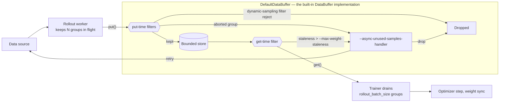

Fully async rollout decouples generation from training so that **rollout never waits on
a training step**. The engines **keep generating continuously** while the trainer
consumes finished groups, instead of the two taking turns.

### When to use it

Use fully async when **rollout is slow**, or when its wall time is set by a **long tail
of straggler trajectories** rather than by the average one, which is most often the case
in **long-context, tool-use, and agentic workloads**. The trade-off is that training
goes **off-policy**, because the trainer consumes groups generated under older weights.
Staying synchronous is recommended while you are debugging a recipe or validating loss
and reward code, where an exact on-policy cadence is worth more than throughput.

## Usage & Examples

### Basic usage

Switch the entrypoint from `train.py` to `train_async.py`, enable the class-based
rollout API, and pass `--fully-async`:

```diff
- python3 train.py ...
+ python3 train_async.py ...
+   --fully-async
```

### Examples

Four launch scripts show the mode end to end, from a single-node smoke test to a
16-node agentic run:

| Script | What it covers |
|---|---|
| [`run_qwen3_30b_a3b_fully_async.py`](https://github.com/radixark/miles/blob/main/examples/infra_features/fully_async/run_qwen3_30b_a3b_fully_async.py) | The same pattern on a 30B MoE, with `tp=8`, `ep=8`, and one 8-GPU rollout engine |
| [`run_qwen3_5_4b_fully_async_eval.py`](https://github.com/radixark/miles/blob/main/examples/infra_features/fully_async/run_qwen3_5_4b_fully_async_eval.py) | Both checkpoint eval backends behind one flag, `--eval-backend fleet` or `--eval-backend external` |
| [`run_glm5_2_744b_a40b_daytona.py`](https://github.com/radixark/miles/blob/main/examples/experimental/openenv/glm52_tbench2/run_glm5_2_744b_a40b_daytona.py) | GLM-5.2 744B-A40B on 16 GB300 nodes, split 8 training and 8 inference, with multi-turn terminal-bench-2 episodes in per-task Daytona sandboxes. It runs 128 in-flight trajectories against a 64-sample train batch and evaluates on the shared rollout engines |

### Customizations

Starting from a working run, the rest of this page covers what you can change:

| To change | See |
|---|---|
| How much generation stays in flight | [Arguments: Scheduling options](#arguments-scheduling-options) |
| How deep the buffer is, how stale a group may be, which groups reach training, or the buffer implementation itself | [Arguments: Buffer options](#arguments-buffer-options) |
| Where eval runs and where it gets its weights | [Evaluation](#evaluation) |
| Which numbers tell you where the bottleneck is, or where the metrics are logged | [Metrics](#metrics) |

## The fully async schedule

### How generation is scheduled

The implementation lives in
[`miles/rollout/fully_async_rollout.py`](https://github.com/radixark/miles/blob/main/miles/rollout/fully_async_rollout.py)
(the worker) and
[`miles/rollout/submission_scheduler.py`](https://github.com/radixark/miles/blob/main/miles/rollout/submission_scheduler.py)
(the submission scheduler).

Fully async rollout splits Miles into two concurrent loops:

1. A background rollout worker keeps SGLang generation in flight and puts completed
   groups into a data buffer.
2. The trainer drains the buffer, runs optimizer steps, and syncs updated weights back
   to the rollout engines.

The worker is a persistent background task, started on the first training step and
generating from then on. It never stops between steps, so a training step no longer
triggers generation; it only takes finished groups out of the buffer.

The worker keeps a bounded amount of generation in flight. It always submits whole
prompt groups, and a **submission scheduler** decides when a finished unit frees the
slot for the next one. Under fully async the default granularity is `sample`: every
finished trajectory frees its own slot, and a new group goes out as soon as
`n_samples_per_prompt` trajectories have completed, whichever groups they came from.
This keeps the engines full when trajectory lengths vary widely, as in agentic
workloads, where holding each slot until the group's slowest trajectory returns would
leave the engines idle.

Generation is the only thing that runs continuously. Everything else still happens on
the driver's step schedule:

1. The trainer drains `--rollout-batch-size` groups from the buffer, waiting if not
   enough have finished yet.
2. It runs the optimizer step while the worker keeps generating.
3. Every `--update-weights-interval` steps it pauses generation, synchronizes the new
   weights through the configured update mode, and resumes. The
   `--pause-generation-mode` flag decides how in-flight requests survive that pause: the
   default `retract` returns them to the waiting queue and recomputes their KV cache,
   while `in_place` freezes them and resumes on the existing cache. Passing `abort`
   would kill them outright, which is why fully async rejects it.

Because generation spans those weight updates, the samples in one group can carry
different weight versions. The gap between a group's oldest weight version and the
engines' current one is its **staleness**, and it is the reason a group that finished
long ago may no longer be worth training on.

### Arguments: Scheduling options

Three flags control how much generation stays in flight:

| Flag | Effect |
|---|---|
| `--rollout-batch-size` | Groups the trainer consumes per step. It is also the default in-flight cap, so raising it widens both the batch and the concurrency unless `--async-max-concurrent-samples` is set |
| `--async-max-concurrent-samples` | In-flight cap in trajectories rather than groups, floored to `value // n_samples_per_prompt` groups. Use it to decouple generation concurrency from batch size |
| `--rollout-submission-granularity` | Sets when a finished unit frees a submission slot. Under `--fully-async` the default is `sample`, which frees each slot as its own sample completes; `group` holds the slot until the whole group returns |

## Data path

### The data buffer

The implementation lives in
[`miles/rollout/fully_async_data_buffer.py`](https://github.com/radixark/miles/blob/main/miles/rollout/fully_async_data_buffer.py).

The **data buffer** is the store of finished groups between the two loops, and every
group-level decision lives in it. The producer puts each group in as it completes, the
trainer takes groups back out one at a time, and everything in between — what to keep,
what to discard, what to send back for regeneration — is the buffer's call. It is one
replaceable component with three methods:

| Method | Called by | Purpose |
|---|---|---|
| `put()` | The rollout worker, once per finished group | Store the group, or reject it |
| `get()` | The trainer, once per group it needs | Return the next group to train on, waiting if none is available |
| `get_metrics()` | The trainer, once per step | Report what the buffer did since the previous step |

Those three methods are the whole interface: the worker and the trainer see nothing
else, and everything inside the box below is the built-in `DefaultDataBuffer`.



Groups are filtered at two points, because the two decisions become available at
different times. Whether a group was aborted, and whether
`--dynamic-sampling-filter-path` keeps it, is fixed the moment generation finishes, so
both are decided on `put()`. Staleness depends on how long the group then sits in the
buffer, so it is decided on `get()`. Once the trainer has a full batch it sorts the
groups by index and applies `--rollout-sample-filter-path` to the assembled batch.

If a sample cancels itself (for example, a sandbox client raises `CancelledError`),
its group is marked aborted after the sibling samples settle. The default buffer
discards the entire group from training, counts it in
`rollout/fully_async/aborted_groups_filtered`, and applies
`--async-unused-samples-handler` to the original prompts. Other groups keep running.
Cancelling the producer itself still propagates, and unexpected non-cancellation
exceptions still fail the worker rather than being silently discarded.

The buffer decouples the two loops. As long as it holds finished groups, the trainer
never waits for generation. If it sits empty, rollout is still the bottleneck and async
cannot hide it.

### Arguments: Buffer options

Buffer capacity bounds how far generation can run ahead of training:

| Flag | Effect |
|---|---|
| `--async-data-buffer-capacity-factor` | Buffer holds `floor(factor * rollout_batch_size)` groups, `2.0` by default. When it is full the producer blocks until training consumes |

Staleness control decides which of those groups training is allowed to see:

| Flag | Effect |
|---|---|
| `--max-weight-staleness` | Maximum gap between a group's oldest weight version and the current engine version. Unset by default, which disables the filter |
| `--async-unused-samples-handler` | What happens to a group training does not use, either aborted or too stale. The default `drop` discards it; `retry` recycles its prompts into the data source for regeneration. Dynamic-filter rejects are always dropped |

When those knobs are not enough, `--custom-async-data-buffer-path` replaces the buffer
itself. This is a larger step than setting any flag above: your `DataBuffer` subclass
takes over all three methods and therefore every group-level decision, and the flags in
this section apply only if your class reads them. The one decision that stays outside is
`--rollout-sample-filter-path`, which runs on the assembled batch rather than on
individual groups.

## Evaluation

Fully async rollout changes one thing about eval: generation is always in flight, so an
eval that runs on the rollout engines costs production time. Two independent choices
follow, which backend runs the eval and where that backend gets its weights.

| Backend | Selected by | Cost |
|---|---|---|
| Shared engines | Neither flag below, which is the default | Rollout production pauses for the eval duration |
| Dedicated fleet | `--eval-num-gpus N` | N GPUs carved out of the job; training never pauses |
| External backend | `--eval-function-path` pointing at a `CheckpointEvalFn` | Nothing from the training job beyond the snapshot export |

The fleet and an external backend each select a backend, so passing both is an error.

### Mode 1: Shared engines

The implementation lives in [`miles/rollout/fully_async_rollout.py`](https://github.com/radixark/miles/blob/main/miles/rollout/fully_async_rollout.py).

Eval runs on the rollout engines. The producer stops submitting for the duration of the
blocking eval and resumes after; in-flight requests finish and buffer, and nothing is
aborted. No extra weight movement is needed, because the engines already carry the
weights the step's `update_weights` broadcast pushed. Production stalls for roughly the
eval duration, which is acceptable for a small debug set and for points that must land
strictly on time.

### Mode 2: Dedicated fleet

The implementation lives in [`miles/ray/rollout/eval_fleet.py`](https://github.com/radixark/miles/blob/main/miles/ray/rollout/eval_fleet.py).

The fleet runs on its own GPUs behind its own router, synced by loading HF checkpoint
snapshots rather than by joining training weight updates:

```bash
--eval-num-gpus 1  # dedicated eval engines, behind their own router
--eval-interval K
--eval-hf-dir /dev/shm/miles_eval_hf  # snapshot staging; tmpfs avoids the disk dependency
--eval-prompt-data aime /path/to/aime.jsonl
```

On each eval-due step the trainer hands the snapshot to the fleet, fires the eval
without waiting for it, and keeps training. Your `--eval-function-path` function
generates against the fleet exactly as it would against the training engines, so custom
eval functions work unchanged. The point lands at the right step on the x-axis even when
it completes a few steps later, and `eval/lag_steps` reports how late it was.

The fleet's engines inherit every `--sglang-*` setting from the rollout engines, so by
default they are configured exactly like the engines you already tuned. You can override
any single field with the matching `--eval-sglang-*` flag:

```bash
--eval-sglang-mem-fraction-static 0.9  # the eval fleet is not sharing with training
--no-eval-sglang-enable-dp-attention  # booleans take a --no- form to turn an inherited True off
```

Tensor parallelism (TP) is the exception, because it comes from
`--eval-num-gpus-per-engine`, which also places the engines. SGLang ties `dp_size`,
`pp_size`, `ep_size`, and `attn_cp_size` to TP, so when the eval and rollout TP sizes
differ those four default to 1 instead of being inherited; inheriting them across a
different TP produces an engine that fails SGLang's own validation at boot. You can set
them explicitly with `--eval-sglang-*` if the fleet is large enough to want them.

### Mode 3: External backend

The contract lives in [`miles/rollout/checkpoint_eval.py`](https://github.com/radixark/miles/blob/main/miles/rollout/checkpoint_eval.py), with a
reference implementation in [`examples/infra_features/fully_async/external_eval_fn.py`](https://github.com/radixark/miles/blob/main/examples/infra_features/fully_async/external_eval_fn.py).

Subclass `CheckpointEvalFn` and implement `evaluate_checkpoint(checkpoint_dir, input)`.
The trainer hands over a snapshot path per eval point and owns dispatch, logging, and
garbage collection; raise `EvalSkip(reason)` for an attributable skipped point. Because
the function runs in-job it reads the real training args and logs through the trainer,
with no GPU carve-out.

The reference implementation launches its own SGLang server on spare GPUs or attaches to
an existing one, configured through the env vars documented in the script. A non-SGLang
black box implements the same contract by calling out to its API and mapping the
response into `RolloutFnEvalOutput`.

### The weight snapshot pipeline

The implementation lives in [`miles/ray/rollout/eval_dispatch.py`](https://github.com/radixark/miles/blob/main/miles/ray/rollout/eval_dispatch.py).

The fleet and an external backend both evaluate a checkpoint, so both need
`--eval-interval` and one of these two snapshot sources:

| Source | Set | Cost |
|---|---|---|
| A fresh export per eval point | `--eval-hf-dir`, pointed at tmpfs | `eval/export_time_seconds` per point, plus staging space |
| The periodic HF checkpoints | `--eval-hf-dir` unset and `--save-hf` set | None, but `eval_interval` must be a multiple of `save_interval` |

On a real run you are persisting checkpoints anyway, so reuse costs nothing. A test run
that saves no checkpoints needs the export, and a tmpfs staging directory keeps it off
disk.

The export is the one part of a point that is not fire-and-forget: it is a collective
across every train actor and the training loop waits for it. Under the default
`--eval-overflow-policy backpressure` a due point can also wait out the oldest pending
eval; `--eval-overflow-policy skip` drops it instead so a slow eval set can never stall
training.

Size the staging directory before pointing it at tmpfs. Snapshots are retired on every
outcome, but the directory holds up to `--eval-keep-snapshots` retired plus
`--eval-max-in-flight` still-evaluating model-sized directories at once, four by
default, so around 32 GB of `/dev/shm` for a 4B model in bf16. Evals are serialized
inside the trainer, so raising `--eval-max-in-flight` does not run more of them at once;
it lets the trainer export further ahead at the cost of one more snapshot on disk.

## Metrics

### Async rollout metrics

The buffer reports these metrics to wandb on every training step, alongside the
standard rollout metrics:

```text
rollout/fully_async/queue_size
rollout/fully_async/aborted_groups_filtered
rollout/fully_async/stale_groups_filtered
rollout/fully_async/avg_staleness, rollout/fully_async/max_staleness
rollout/fully_async/buffer_avg_staleness, rollout/fully_async/buffer_max_staleness
rollout/dynamic_filter/drop_<reason>
```

The `avg_staleness` and `max_staleness` pair covers the groups training actually
consumed, while the `buffer_` pair covers the groups still sitting in the buffer when
the step drained it.

A `queue_size` pinned at zero means rollout is the bottleneck, so scale rollout capacity
or lower per-sample generation cost. A `queue_size` pinned at capacity means training is
the bottleneck, and the `buffer_` staleness metrics will climb with it. A rising
`stale_groups_filtered` means groups are aging out faster than the trainer consumes
them. In the logs, a `No completed rollout groups for 30.0s` warning means the drain is
starved.

### Async eval metrics

The metrics are logged in [`miles/ray/rollout/metrics.py`](https://github.com/radixark/miles/blob/main/miles/ray/rollout/metrics.py).

Every skipped point is logged at the step it would have landed on, with the reason:

| Metric | Cause |
|---|---|
| `eval/skipped_busy` | At `--eval-max-in-flight` under `--eval-overflow-policy skip` |
| `eval/skipped_export_failed` | The snapshot export raised |
| `eval/skipped_ckpt_missing` | No `.complete` marker in the snapshot directory |
| `eval/skipped_crashed` | Anything else the eval raised |
| `eval/skipped_<reason>` | A `CheckpointEvalFn` raised `EvalSkip(reason)` |

For a point that did run, `eval/{dataset}/weight_version/mean == eval/step` and
`eval/{dataset}/weight_version/mixed_version_ratio == 0` together confirm it measured
exactly the intended weights. A checkpoint backend measures the actor's exact weights at
that step, whatever the broadcast schedule. Shared engines measure the engines'
last-broadcast version, which equals the actor's current weights when
`--update-weights-interval` is 1.

### Performance metrics

For performance work, use the metrics below as a basic reference:

1. **Engine concurrency.** Watch `sglang_num_running_reqs` across engines. If some
   engines sit far below the others, or concurrency collapses without a weight update to
   explain it, check the router configuration — requests are not being spread evenly.
2. **Prefix cache hit rate.** Watch `sglang_cache_hit_rate` per engine, or the per-step
   `prefix_cache_hit_rate` in the rollout metrics. A coding-agent workload should stay
   above 90%, since every turn re-prefills its session prefix. If it is low, suspect the
   KV cache memory (`--sglang-mem-fraction-static`) and the router configuration.
3. **Where the time goes.** Compare rollout time, train time, and the staleness metrics.
   If rollout is slower, consider more GPUs for rollout, a higher
   `--async-max-concurrent-samples`, and throughput-oriented SGLang settings. If
   training is slower, consider more GPUs for training, a lower concurrency, and
   latency-oriented SGLang settings.
### Arguments: Logging options

Two flags replace the default metric logging, both defined in
[`miles/ray/rollout/metrics.py`](https://github.com/radixark/miles/blob/main/miles/ray/rollout/metrics.py):

| Flag | Signature |
|---|---|
| `--custom-rollout-log-function-path` | `log_rollout_data(rollout_id, args, samples, rollout_extra_metrics, rollout_time) -> bool` |
| `--custom-eval-rollout-log-function-path` | `log_eval_rollout_data(rollout_id, args, data, extra_metrics) -> bool` |

Returning `True` skips the default logging for that call, so a function that only
forwards metrics elsewhere should return `False` and leave the built-in logging in
place. To change which numbers the buffer reports in the first place, override
`get_metrics()` on a custom buffer instead, as described in
[Arguments: Buffer options](#arguments-buffer-options).
